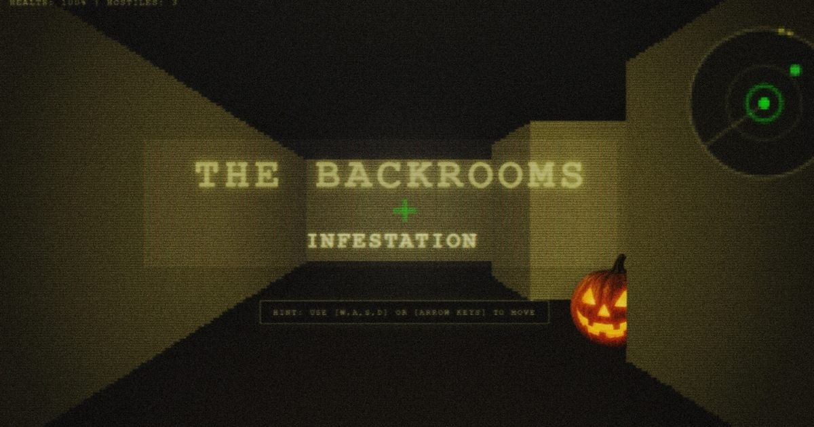

# THE BACKROOMS: INFESTATION

**A procedurally generated liminal horror survival game built in a single (84.38 KB) file.** No external libraries, no game engines, no image assets. Pure Vanilla JavaScript, HTML, and CSS.

[🎮 **PLAY THE GAME LIVE HERE**](https://speedaily.github.io/backrooms-infestation/)

---

## THE DESCENT
You are trapped. Escape the procedurally generated corridors. Beware the anomalies. They emit radioactive signatures and will hunt you down if they gain line of sight. Do not let them close.

---

## SURVIVAL PROTOCOLS (CONTROLS)
*   **W, A, S, D / ARROW KEYS:** Move and slide along corridors[cite: 3].
*   **SHIFT:** Hold to sprint and escape anomalies[cite: 3].
*   **MOUSE DRAG:** Rotate look direction[cite: 3].
*   **LEFT CLICK:** Locks cursor to screen & fires hitscan railgun[cite: 3].
*   **ANOMALIES (🎃, 😡, 👿):** Sidestep your crosshairs if you shoot. Distance < 2m emits heavy radiation that drains health[cite: 3].
*   **MEDKITS:** Stand over the green crosses to restore 40 HP[cite: 3].

---

## TECHNICAL ARCHITECTURE
This project is an exercise in extreme optimization and zero-dependency web development.
*   **Zero External Assets:** All rendering, textures, and UI elements are generated via raw code or HTML Canvas elements. 
*   **Custom Raycaster:** A scratch-built 2.5D rendering engine running natively in the browser viewport.
*   **Procedural Generation:** Infinite level scaling using a DFS recursive backtracker maze algorithm.
*   **Procedural Audio:** Footsteps, deep hum drones, basslines, and heartbeat effects are synthesized in real-time using the native Web Audio API[cite: 3].
*   **Offline Capable:** Because the entire game logic lives inside `index.html`, it can be downloaded and played natively on any desktop without an internet connection.

---

## LOCAL INSTALLATION
Want to run the raw code offline?
1. Clone or download this repository.
2. Open `index.html` in any modern web browser (Chrome, Edge, Firefox, Brave).
3. Survive.

---

## LICENSE
Created by **SpeeDaily**.
This project is open-source and licensed under the MIT License. Feel free to fork, modify, and learn from the architecture.
